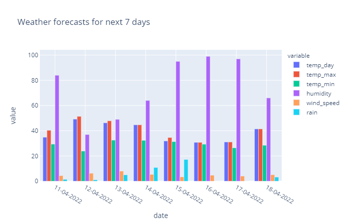
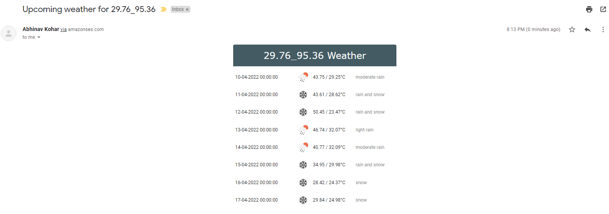
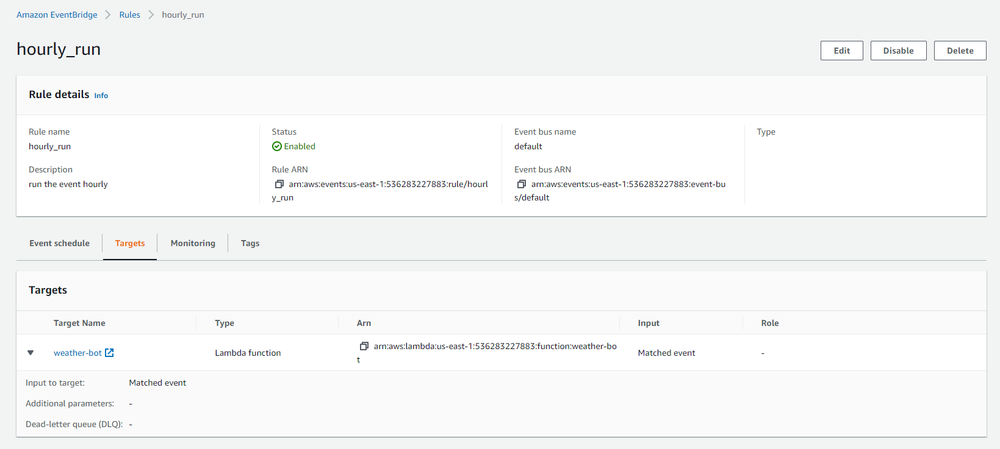
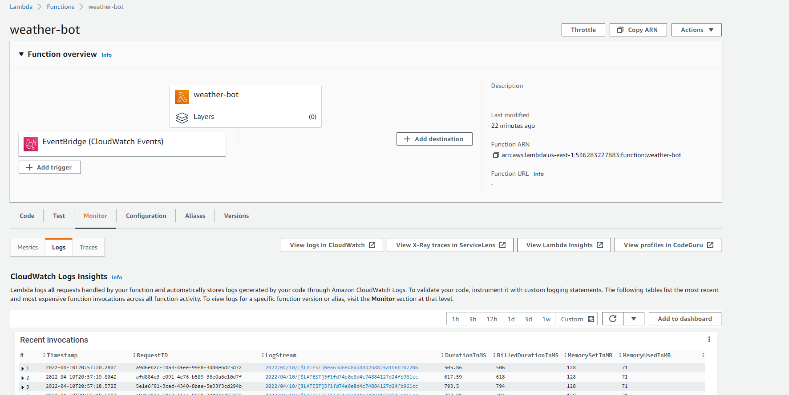
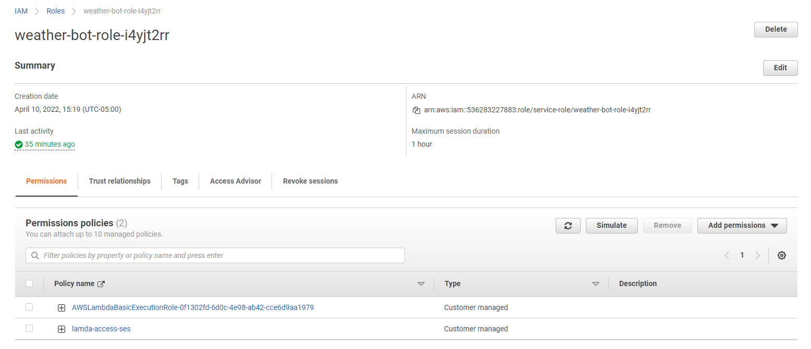

# Weather BOT

## Overview

This is a weather bot to send daily weather updates to an email list using AWS Lamda, Amazon SES and python

## Technology Stack

* [Python](https://www.python.org/)
* [AWS Lambda](https://aws.amazon.com/lambda/)
* [AWS Eventbridge](https://aws.amazon.com/eventbridge/)
* [AWS SES](https://aws.amazon.com/ses/)
* [OpenWeatherMap API](https://openweathermap.org/api)

## Notebooks
* Python Notebook 1: notebook_1_Abhinav_kohar.ipynb -- Notebook that can take lat long inputs and generate weather report/forecast with charts for the location
* Python Notebook 2: notebook_2_Abhinav_kohar.ipynb -- Notebook that has function to send an email to given email_id
* Python Notebook 3: notebook_3_Abhinav_kohar.ipynb -- Notebook that can take lat/long, email_id as input at top and when run sends an email of weather report

## Example

## Setup

**AWS**

* Configure the [aws cli](https://docs.aws.amazon.com/cli/latest/userguide/cli-chap-configure.html)
* [Verify email addresses to send/receive email while in sandbox mode](https://docs.aws.amazon.com/ses/latest/DeveloperGuide/verify-email-addresses.html)
* Sign up for the [OpenWeatherMap API](https://openweathermap.org/appid) and use the provided API key to set an `OPEN_WEATHER_MAP_API` environment variable
* Create a lambda function called `weather-reminder`. Note: if your lambda is called something different, rename instances of `weather-reminder` to your lambda function name. This especially applies to build and deploy shell scripts in the `scripts` directory.
* Provide values for all environment variables mentioned in `.env.template` to the lambda function
* [Configure AWS Eventbridge to trigger the lambda function](https://docs.aws.amazon.com/eventbridge/latest/userguide/eb-run-lambda-schedule.html)

**Local**

* Setup a virtual environment, `python3 -m venv .venv`
* Run `pip install -r requirements.txt` to install dependencies
* Run `python lambda_function.py` to test locally
    * Note: Either populate a `.env` file and [load its contents for local development](https://github.com/theskumar/python-dotenv) or manually replace environment variables used in the code with values while testing locally.
    ** pip install python-dotenv
    ** from dotenv import load_dotenv
    ** load_dotenv()

## Deployment

* Run `./scripts/build-deploy.sh` to build and deploy the lambda to AWS
* Run `./aws/ses/scripts/ses-create-weather-reminder-template.sh` to create the `WeatherReminderTemplate` email template in SES
* Run `./aws/ses/scripts/ses-update-template-weather-reminder.sh` to update the `WeatherReminderTemplate` email templae in SES

* Update the email sending persmissions for lamda user
https://docs.aws.amazon.com/ses/latest/dg/control-user-access.html#iam-and-ses-examples-email-sending-actions
* Set the run schedule 
https://docs.aws.amazon.com/lambda/latest/dg/services-cloudwatchevents-expressions.html

* AWS eventbridge

* AWS lamda function

IAM 

